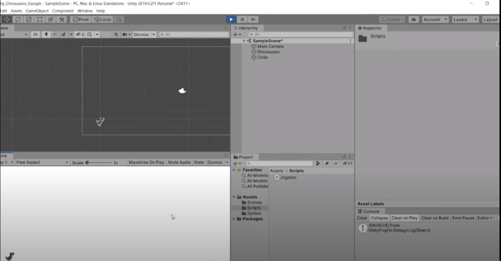
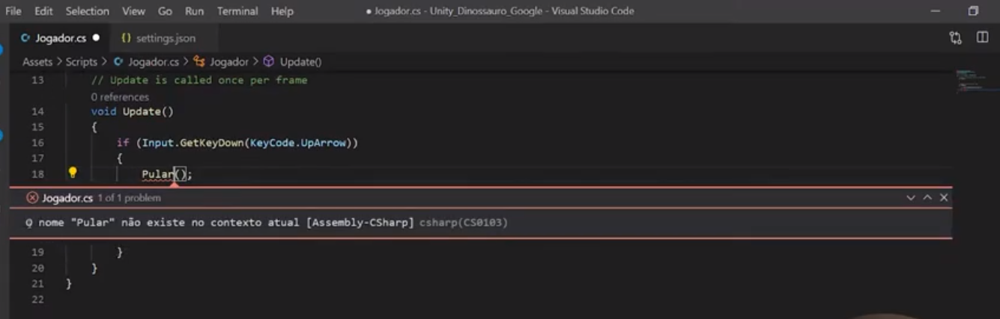
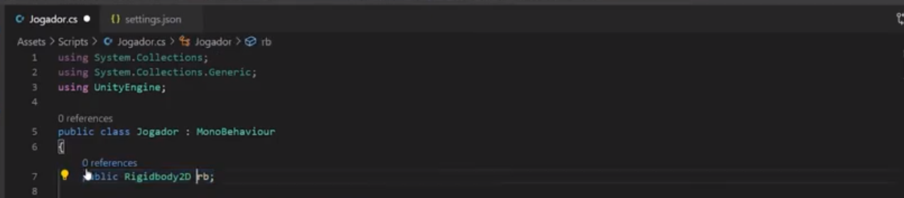
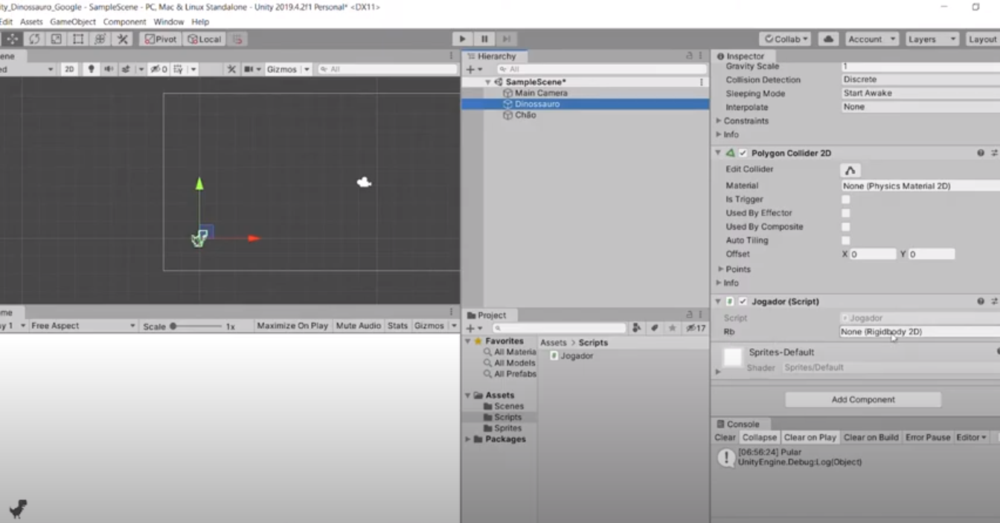
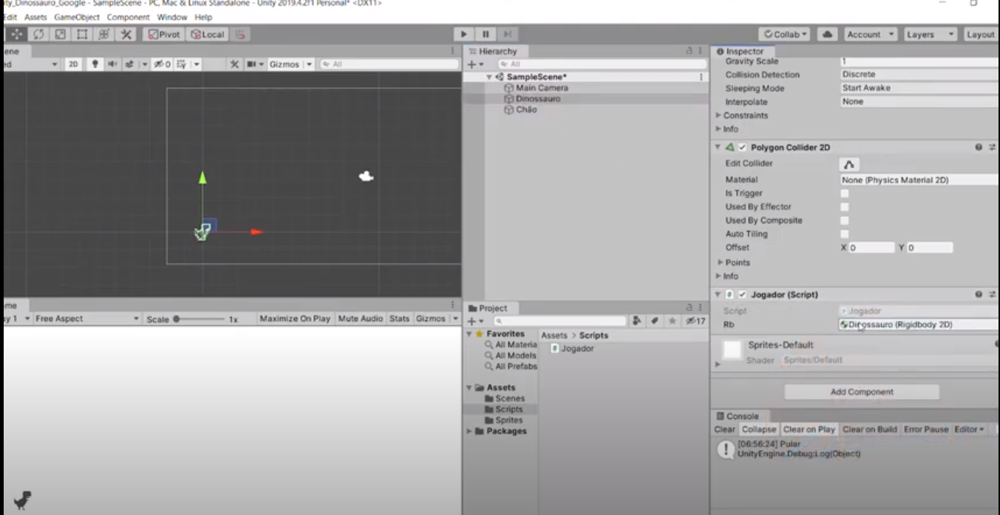
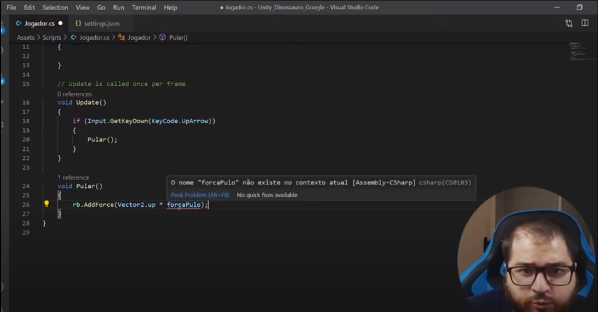
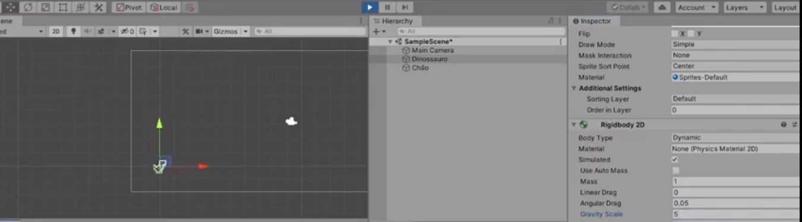

# Jogo do Dino: Programando o Pulo

Agora é hora de abrir o editor de códigos e começar a entender como construir o pulo do personagem, utilizando a linguagem de programação C#.

## Criação do Script

1. Abra o projeto que começamos na aula anterior;
2. Abra a cena `SampleScene`;
3. Selecione o `GameObject` do Dinossauro;
4. Vá até o `Inspector` e clique no botão `Add Component`;
5. Digite o nome do script, no caso será `Jogador` (certifique-se de que o nome começa com letra maiúscula);
6. Após a criação do script, clique com o botão direto na pasta `Assets`, selecione `Cre até > Folder`. Arraste o script `Jogador` para dentro da pasta recém criada. (Isso irá nos ajudar na organização dos scripts).

## Configurando o Visual Studio Code

1. Abra o `Visual Studio Code`;
2. Abra o arquivo `settings.json`, localizado dentro da pasta `.vscode`;
3. Logo após a primeira linha do arquivo, que contém uma chave `{`, cole o seguinte trecho:

```json
 "editor.formatOnSave": true,
 "editor.formatOnType": true,
 "editor.formatOnPaste": true,
 "explorer.confirmDelete": false,
 "explorer.confirmDragAndDrop": false,
 "files.insertFinalNewline": true,
 "files.trimFinalNewlines": true,
 "files.trimTrailingWhitespace": true,
```

- Note que o trecho copiado começa na `linha 2` do arquivo e termina na `linha 9`, logo antes da linha 10 que contém o trecho `"files.exclude":`;

3. Aperte o atalho `Ctrl + S` duas vezes. Uma delas será para salvar as alterações. E a segunda para ativar uma das configurações (`"editor.formatOnSave": true,`), que ajusta a formatação sempre que o arquivo é salvo.

## Programando o Pulo

O primeiro passo para começarmos o nosso jogo é a construção do comportamento do pulo do dinossauro. Sempre que o jogador pressionar a tecla `seta para cima`, ou `UpArrow`, iremos fazer com que o dinossauro receba uma força na direção para cima, simulando o comportamento de pulo.

### Código completo

Explicaremos o passo a passo para construir o código do pulo, porém, caso queira testar a implementação, você pode usar o código completo, disponível a seguir.

> **Caso use o código completo, você deverá atribuir a referência do `Rigidbody` para que ele funcione.** Mais informações sobre isso vá na sessão em que explicamos o código.

```c#
using System.Collections;
using System.Collections.Generic;
using UnityEngine;

public class Jogador : MonoBehaviour
{
  public Rigidbody2D rb;

  public float forcaPulo = 700;

  public LayerMask layerChao;

  public float distanciaMinimaChao = 1;

  priv até bool estaNoChao;

  // Start is called before the first frame Update
  void Start()
  {

  }

  // Update is called once per frame
  void Update()
  {
    if (Input.GetKeyDown(KeyCode.UpArrow))
    {
      Pular();
    }
  }

  void Pular()
  {
    if (estaNoChao)
    {
      rb.AddForce(Vector2.up * forcaPulo);
    }
  }

  priv até void FixedUpdate()
  {
    estaNoChao = Physics2D.Raycast(transform.position, Vector2.down, distanciaMinimaChao, layerChao);
  }
}
```

### Explicando o código

> Ainda no Visual Studio Code, abra o arquivo `Jogador.cs`, localizado dentro da pasta `Scripts`.

Agora iremos iniciar a configuração do pulo, mas para isso, é preciso entender duas funções:

- A primeira delas é o `Start`, que é executado sempre que o jogo começa, sendo chamado uma vez para cada objeto que tenha um script. 

- A segunda é o `Update`, que é executar uma vez por quadro. Pense em um jogo de 60 FPS (60 quadros por segundo), a Unity irá executar o `Update` 60 vezes por segundo.

Portanto, se quisermos checar sempre que uma tecla for pressionada, devemos fazer isso no `Update`, visto que essa ação precisa ser validada sempre, pois não sabemos quando o jogador a pressionará.

Utilizaremos um `if`, que recebe uma condição `booleana` e, sempre que essa condição for `true`, ele executa o trecho de código dentro das chaves `{}`.

Dentro dos parênteses do `if`, o comando que detecta se o jogador pressionou uma tecla é o `Input.GetKeyDown()`, recebendo qual o `KeyCode` da tecla que será validada, portanto, receberá `KeyCode.UpArrow`.

Para validar se o `if` está sendo executado corretamente, exibiremos a mensagem `"Pular"` no `console`, utilizando a declaração `Debug.Log("Pular")`:

```c#
void Update()
{
  if (Input.GetKeyDown(KeyCode.UpArrow))
  {
    Debug.Log("Pular");
  }
}
```

> Volte para Unity, espere ela compilar o código e verificar se há algum erro. Aperte `Play` na cena e, quando o jogo iniciar, aperte a `seta para cima`. Verifique se a mensagem `"Pular"` aparece no Console.



> Volte para o Visual Studio Code e apague a linha `Debug.Log("Pular")` e substitua por `Pular()`. Uma mensagem de erro irá aparecer, dizendo que `O nome "Pular" não existe no contexto atual`, pois ainda não declaramos no código o que o método `Pular()` significa.



> Depois da `}` do `Update` e antes da `}` que fecha a classe `Jogador`, declare o método `Pular`, através da declaração `void Pular() {}`:

```c#
using UnityEngine;

public class Jogador : MonoBehaviour
{
  void Update()
  {
    if (Input.GetKeyDown(KeyCode.UpArrow))
    {
      Pular();
    }
  }

  void Pular()
  {
  }
}
```

Para adicionar uma força que empurre o objeto para cima, precisamos ter acesso ao componente de física que está no dino, o `Rigidbody`. Para isso, precisamos declarar uma propriedade `public` fora dos métodos `Update` e `Pular` que criamos, mas dentro da classe `Jogador`. Dessa forma, a Unity mostrará essa informação no `Inspector`, para que a gente possa realizar a conexão.

> Após a `{` da classe `Jogador` (na linha 6), crie duas linhas pressionando `Enter` e adicione o comando `public Rigidbody2D rb`:

```c#
public class Jogador : MonoBehaviour
{
  public Rigidbody2D rb;
  
  // ...
}
```



> Salve o código (`Ctrl + S`), certifique-se de que a bolinha branca ao lado do nome `Jogador.cs` sumiu e volte para a Unity.
>
> Na aba `Hierarchy`, selecione o `GameObject` do `Dinossauro` e, na guia `Inspector`, procure pelo componente `Jogador (Script)`, verificando se apareceu a variável `rb`. Caso não tenha aparecido, verifique se o console exibiu algum erro e confira se o seu código está correto.



> Em seguida, clique no `Dinossauro`, segure e arraste até `None (Rigidbody 2D)`. Com isso, o script irá reconhecer o `Rigidbody2D` que foi atrelado a ele.



> Salve a cena

#### Adicionando Força ao Pulo

Com a referência do `Rigidbody2D` do Dinossauro feita, podemos usar a variável `rb` para adicionar uma força para cima, dando a sensação de que o `GameObject` está pulando.

> Volte para o script do `Jogador`, no Visual Studio Code, e, dentro do método `Pular() {}`, adicione o comando `rb.AddForce(Vector2.up * forcaPulo)`.

- `rb`: Acessar o `Rigidbody2D` do Dinossauro;

- `AddForce`: Método que adicionar força em uma direção

- `Vector2.up`: É o mesmo que declarar `new Vector2(0, 1)`, ou seja:
  - Neutro no eixo X, representando sem movimentação horizontal (para os lados);
  - Positivo no eixo Y, representando movimentação vertical para cima.
- `* forcaPulo`: Multiplicamos a direção do movimento representada por `Vector2.up` por uma força, para que consigamos modificar a intensidade do pulo.

```c#
void Pular()
{
    rb.AddForce(Vector2.up * forcaPulo);
}
```

**Note que o Visual Studio Code não reconhece a variável `forcaPulo`, pois devemos declará-la no começo da classe, para que consigamos alterar pelo `Inspector` da Unity.**



Para controlar a intensidade do pulo na variável `forcaPulo`, utilizaremos o tipo `float`, que permite a inserção de números com casas decimais.

> Vá no começo da classe `Jogador` e, logo após a declaração do `Rigidbody2D`, declare o comando `public float forcaPulo;`.
>
> Salve o script e volte para a Unity.

```c#
public class Jogador : MonoBehaviour
{
    public Rigidbody2D rb;

    public float forcaPulo = 700;

    // ...
}
```

#### Configurando a Força e a Gravidade

> Na aba `Hierarchy`, selecione `Dinossauro`.
>
> Na aba `Inspector`, desça até o `Jogador (Script)` e verifique se apareceu a variável `Forca Pulo`.
>
> Altere o valor de `Forca Pulo` para `300`.
>
> Caso não tenha aparecido, verifique se salvou o código no Visual Studio Code ou se há algum erro no console.


Note que o dinossauro ainda está demorando muito para cair. Isso ocorre pois a gravidade do Dinossauro ainda está muito baixa, precisamos aumentá-la.

> Na aba `Inspector`, vá até o componente `Rigidbody 2D`, e altere o valor de `Gravity Scale` para `5`.

Ao realizar essa alteração, note que a força que estávamos aplicando ao pulo não é mais suficiente para fazer com que o dinossauro chegue na mesma altura. Isso ocorre pois a força que a gravidade está exercendo é cinco vezes maior que antes. Para corrigirmos isso, basta aumentar o valor da força do pulo para algo que ache interessante.

> Altere o valor da variável `Forca Pulo` do `Jogador (Script)` para `800`, ou algo que ache interessante.



**É importante verificar se as alterações foram feitas com o `Play` acionado. Caso esteja, será necessário sair do `Play` e alterar `Forca Pulo` e `Gravity Scale` novamente, pois ao sair do `Play`, todas as modificações são desfeitas.**

### Concluindo

> Salve a cena e faça os últimos testes para garantir que tudo está funcionando como esperado.

Agora que o código do pulo está pronto, suba as modificações no `GitHub` através de um `Commit` e um `Push`, para que elas fiquem salvas na nuvem.