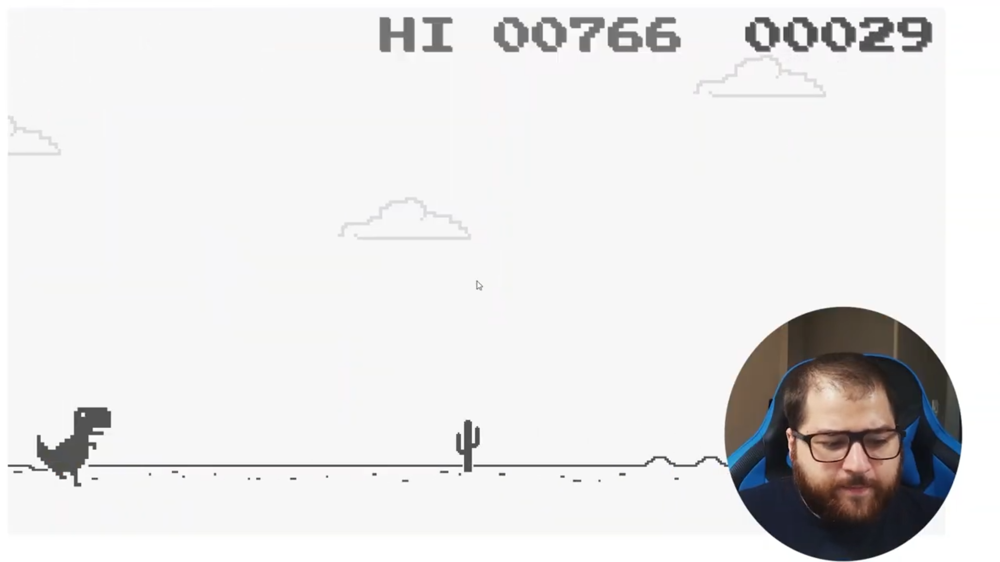
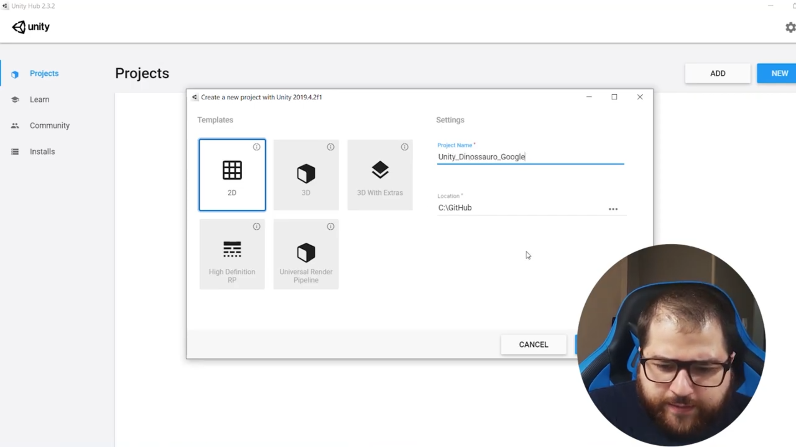
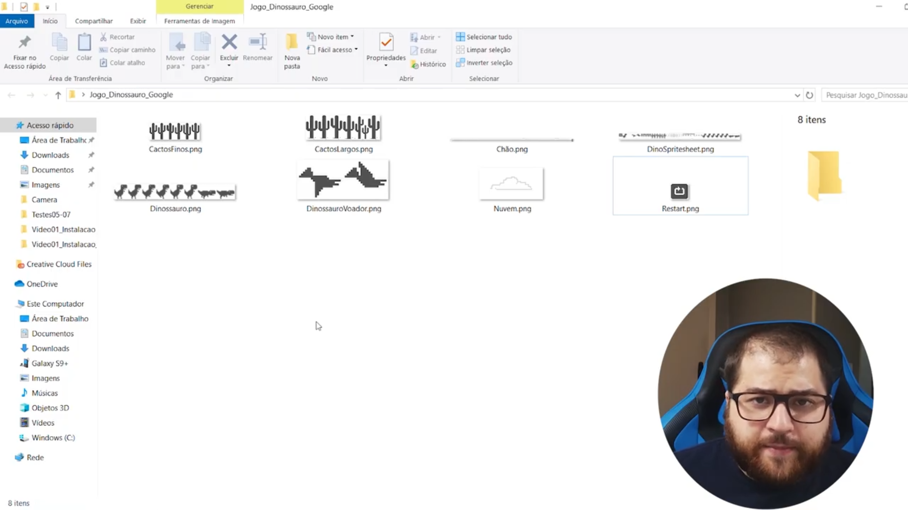

# Criando o Projeto e o Cenário

Bora começar a desenvolver o jogo do dinossauro do Google Chrome! Aquele joguinho que habilita quando você tá sem internet.

Nesse tutorial você vai criar o projeto na Unity, subir na sua conta do GitHub, importar os arquivos iniciais e construir o cenário base do jogo.

Ao final dessa série de tutoriais, você saberá como publicar o jogo online na Web (hospedando de graça!) e também faremos uma versão para rodar em qualquer celular Android.

Com o jogo pronto, uma outra série de vídeos mostra como fazemos para criar uma inteligência artificial que aprenderá a jogar o jogo do dino melhor do que qualquer ser humano!

## Pré-requisitos

1. Unity Hub instalado (https://unity3d.com/pt/get-unity/download);
2. Alguma versão da Unity instalada;
3. Verificar se a versão do .NET (SDK 4.7.1)
4. Visual Studio Code instalado (https://code.visualstudio.com/download) e configurado (https://www.youtube.com/watch?v=Ny5g3YwPT5Y);
5. GitHub Desktop instalado (https://desktop.github.com/) e conectado a uma conta (ou conhecimentos equivalentes de `Git` para criar e fazer upload do repositório).

## Criação do Projeto

1. Abra o Unity Hub;
2. Clique na aba `Projects` no menu superior esquerdo;
3. Clique no botão `New` no menu superior direito;
4. Selecione a opção `2D`;
5. Digite o nome do projeto `Unity_Dinossauro_Google`;
6. Em `Location`, escolha um local para a pasta, de preferência um caminho curto, como `C:\GitHub`;
7. Clique no botão `Create`.

## Criando um repositório do projeto no GitHub

1. Abra o GitHub Desktop;
2. Com a conta conectada, vá na opção `File > New Repository` (`Ctrl + N`);
3. Na janela que abriu, na caixa de texto `Name`, digite o mesmo nome do projeto;
4. Certifique-se de que em `Local path` está o mesmo caminho em que criou o projeto. Sempre uma pasta antes do projeto, então no meu caso, `C:\GitHub`;
5. Em `Git ignore`, selecione a opção `Unity`;
6. Opcionalmente, em `License`, selecione a opção `MIT License`;
7. Clique no botão `Create`.

1. Assim que terminar a criação do repositório, na parte superior central da tela, clique em `Publish repository`;
2. Opcionalmente, caso queira deixar o projeto público, desmarque a caixinha `Keep this code private`;
3. Clique no botão `Publish repository`.

## Baixando e Importando os arquivos inicias

1. Faça o download dos arquivos iniciais do projeto, também conhecido como `assets`;

    - https://drive.google.com/file/d/1exKktXjKR56FCsxHqR9gclssfeRXMVmW/view
2. Extraia os arquivos em uma pasta separada;

3. Abra a Unity e, na aba `Project`, clique no botão `+`, localizado na parte superior esquerda da aba;
4. No menu suspenso, clique na opção `Folder` e nomeie a pasta como `Sprites`;
5. Abra a pasta em que extraiu os arquivos, selecione todos, arraste e solte na Unity, dentro da pasta que acabou de criar;
6. Selecione todos os arquivos e, na aba do `Inspector`
