# Git e GitHub: Introdução

## Introdução

Nesta apostila iremos explicar o que é a tecnologia Git, como ela é aplicada com os projetos na Unity. Veremos também como é feito a criação/configuração de um projeto no GitHub. A ideia é mostrar o quão importante essas ferramentas podem ser no seu dia a dia de trabalho. E para aqueles que estão começando sua carreira agora, é extremamente importante a documentação dos primeiros projetos, usando o GitHub como repositório. 

##  Criando a conta no GitHub

Para iniciarmos será necessário a criação de um usuário para acessar a ferramenta.

>  Acesse o site https://github.com/, preencha os campos Username / Email / Password e clique em `Sign up for GitHub`.  Automaticamente um e-mail de confirmação será enviado para sua caixa. Será necessário fazer a confirmação. 
>
> Logo após confirmar o e-mail, faça o login para iniciarmos a criação do repositório.

## Criando o repositório no GitHub

Agora com nossa conta criada e já com nosso login feito, é hora de iniciar a criação do nosso repositório. 

> No canto direito superior, entre o sininho e o avatar do seu perfil, clique no sinal de mais (+) e logo após selecione a opção `New Repository` .
>

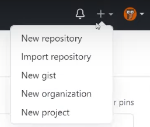

Já na página do novo repositório, iremos preencher e selecionar algumas informações.

A primeira delas é o `Owner`. Ela já estará pré-setada com seu usuário. Logo após temos o `Repository name`, que será o nome do nosso repositório. Em seguida temos a opção `Description ` que servira para adicionar algum comentário se for necessário(Opcional). Mais abaixo, temos as seguintes opções (Public/Private). Caso selecione a opção `Public`, você deixará seu repositório aberto para qualquer pessoa da internet tenha acesso. Porém você escolhe as pessoas que irão poder adicionar arquivos ao seu projeto. 

A opção `Private`, torna seu repositório privado, porém você escolhe as pessoas que poderão ver e adicionar arquivos ao projeto.

Mais abaixo temos a opção `Initialize this repository with` Porém é um tema que iremos abordar em outros episódios. 

Em nosso tutorial em vídeo preenchemos as informações da seguinte maneira:

> * `Owner`: FabricaDeSinapse
> * `Repository Name`: Repositorio_Exemplo (Neste campo aconselhamos que você crie um padrão de preenchimento. Sempre iniciar as palavras com letras maiúsculas ou minúsculas, e isto fica a seu critério. E também alterar o espaço por underline(_)ou barra (-), pois o campo não aceito espaço entre as palavras). 
>
> * Selecionamos a opção `Public`, porém você pode selecionar a opção que for mais viável para sua necessidade no momento.
> * Clique no botão `Create Repository`.

 Pronto agora temos nosso repositório criado.

## Criando um arquivo pelo GitHub

Para entendermos de forma simples o conceito do GitHub iremos criar um arquivo direto no site para analisar o funcionamento. 

> Com o diretório aberto iremos clicar na seguinte opção: `creating a new file`.

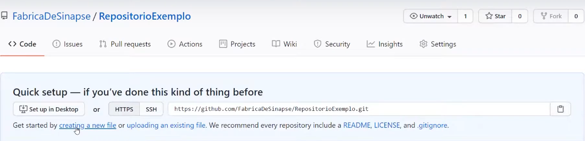

Agora será necessário informar alguns dados referente ao seu arquivo. O primeiro deles é o nome, e logo abaixo temos o a aba `Edit new file` onde iremos colocar o conteúdo do nosso arquivo. Ao lado da aba `Edit new file`, temos aba `Preview` que permite que você pré-visualize como ficou o conteúdo escrito em seu arquivo.

Mais abaixo temos a opção `Commit new file`. Esta opção servirá para registrar o arquivo recém criado. Logo abaixo temos um campo que você poderá nomear seu arquivo como quiser. E logo abaixo temos o campo `Add an opitional extended description`, este campo você usará para adicionar algum comentário caso seja necessário.  

Pronto agora temos um arquivo criado dentro do GitHub. Vamos para o próximo passo.

## Enviando um arquivo do seu computador para o projeto

Suponhamos que você tenha um arquivo em seu computador e precise adicionar ao seu projeto. Vamos lá.

> Crie um arquivo no bloco de notas ou notpad++ com qualquer conteúdo e salve, iremos usar apenas como exemplo.
>
> Em seu repositório existe a opção `Add file`, ela nos da as opções `Create new file` que serve para criar um novo arquivo, e a opção `Upload files` que usaremos para fazer o Upload do arquivo. 

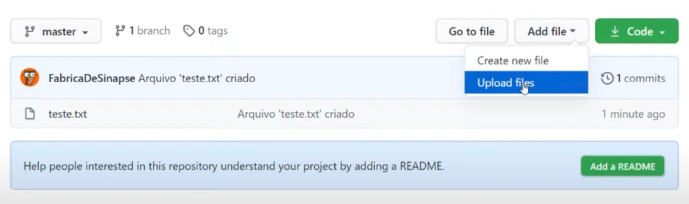

> Após selecionar está opção, uma nova página se abrirá pedindo para você arrastar o arquivo até o local, e a opção `Choose your files`, que permite que você navegue até aonde o arquivo foi salvo. 

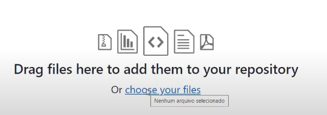

Automaticamente o GitHub fará o upload do arquivo e mostrará com o nome que você salvou abaixo da tela acima.

> Agora para que possamos registrar o upload do arquivo no repositório, será necessário nomear está ação no campo `Commit changes` , e caso necessário adicionar algum comentário no campo abaixo(`Add an optional extended description`). E selecione a opção `Commit directly to the main branch`. 

Nos próximos capítulos desta saga, iremos detalhar melhor o que se refere a opção `Commit directly to the main branch`. 

> Logo abaixo, clique em `Commit changes ` para que o registro seja feito.

## Baixando e Instalando GitHub Desktop

Agora que entendemos como registrar arquivos direto no GitHub através de um repositório. Vamos utilizar o GitHub direto em nossa máquina(Desktop/Laptop). Para isso iremos usar o software `GitHub Desktop` que permite usar a ferramenta em sua máquina.

> Acesse o site https://desktop.github.com/ e clique em `Download for Windows`.
>
> Após o termino do download, abra o arquivo e execute para iniciar a instalação. 

## Configurando o GitHub Desktop

Após a instalação do software, uma tela solicitando o login irá aparecer. Preencha com os mesmos dados que realizou o cadastro no site. 

Em seguida uma tela (`Configure Git`) será aberta. Preencha os dados novamente com os mesmos utilizados no cadastro. Clique em `Continue`. 

Uma nova tela será aberta (`Make GitHub Desktop better!`). Esta opção serve para que seu aplicativo envie dados anônimos de uso para melhoria da ferramenta . Então fica a seu critério marcar ou não. Clique em Finish.

## Clonando um Repositório

Agora que já temos o software instalado, é hora de aprender a copiar os arquivos salvos na nuvem para nossa máquina(Desktop/Laptop), e para insto vamos usar a função clone.

> Selecione o repositório que criamos e clique em `clone +(nome do seu projeto)`.

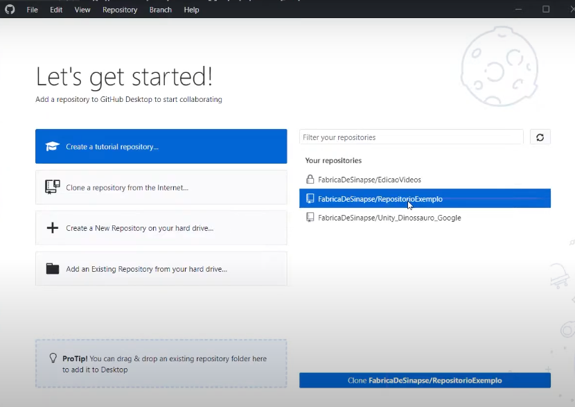

Após executar a função clone, uma nova aba será aberta informando a URL onde o repositório está sendo salvo, e também o local onde os arquivos serão salvos.

> Selecione o local em sua máquina(Desktop/Laptop) onde irá salvar os arquivos. Clique em clone.

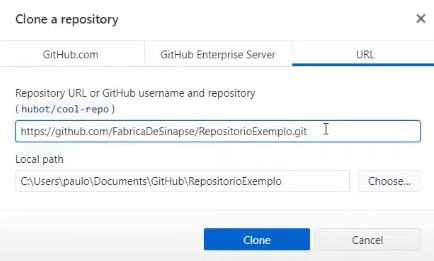

Agora você possui os arquivos criados no repositório em sua máquina(Desktop/Latop). 

## Histórico de commits

Acessando a guia `History`, você tem acesso a todos os commits que foram feitos no repositório. 

## Verificando a pasta do projeto

Bom, agora que já clonamos o repositório para nossa máquina(Desktop/Latop), vamos verificar a pasta dos nossos arquivos.

> Na parte superior, selecione a opção `Repository`, logo em seguida selecione a opção `Show in Explorer`. Isto levara você direto para o local onde você direcionou os arquivos.

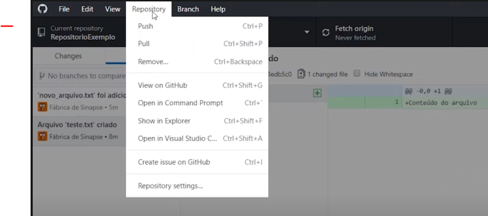

## Modificando os arquivos no computador

Com a pasta do repositório aberta, iremos fazer algumas modificações nos arquivos que adicionamos. Em nosso tutorial em vídeo nos excluímos um dos arquivos e fizemos uma alteração no texto do arquivo(Notpad++). 

> Faça algumas alterações em seus arquivos para visualizar as alterações no GitHub Desktop.

Voltando para o GitHub Desktop ao lado `History`, clique em Changes. Note as marcações exibidas após as alterações realizadas.

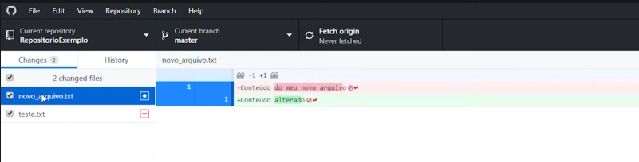

No nosso caso, o arquivo `teste.txt` foi excluído e fizemos uma alteração no arquivo `novo_arquivo`. 

## Commit: Registrando as modificações

Após realizar as alterações nos arquivos iremos registrar as modificações feitas através de um commit. 

> Ainda na tela do GitHub Desktop, desça até a guia `Summary (Required)` .  

Neste local você pode escrever o que quiser, porém é importante usar este campo para lembrar o que você fez e até mesmo para se comunicar, quando se está trabalhando em equipe. Inclusive, caso necessário utilize o campo `Descripition` para detalhar melhor as alterações e novidades.

## Push: Enviando os commits para o GitHub

Ao realizar o commit, volte para guia `History`. Note que um commit foi criado, porém é importante saber que ao realizar este commit as informações ficaram salvas apenas em nossa máquina(Desktop/Laptop). Agora será necessário fazer o registro dessas alterações na nuvem.

> Para isto clique em `Push origin`. Isto fará as alterações serem enviadas para nuvem.

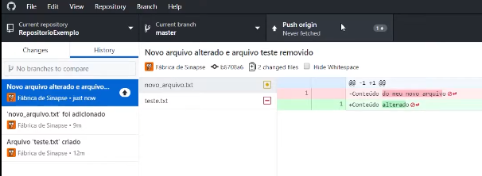

## Visualizando o repositório na nuvem

Feito isto, agora iremos visualizar como as alterações ficaram na nuvem.

> No canto superior esquerdo, clique em `Repository`, e selecione a opção `View on GitHub`. Ou se preferir utilize o atalho(Ctrl + Shift + G)

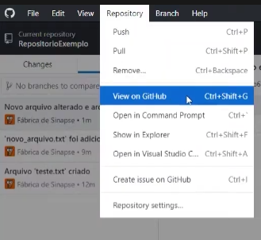

Perceba que ao abrir a nuvem, nossos 3 commits foram realizados.

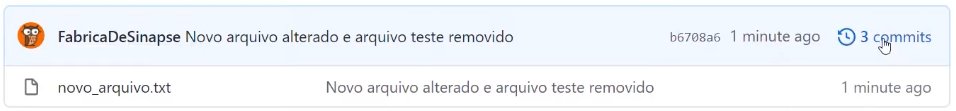

> E ao clicar em `3 commits` selecione um dos nossos arquivos criados. Após selecionar o arquivo selecione a opção `Browse files`.

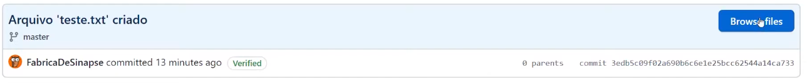

Está opção permite que a gente visualize o repositório exatamente na hora em que fizemos este commit. Praticamente uma habilidade de voltar no tempo. Perceba que ao realizar esta função, na barra de endereços foi gerado um código, logo após do endereço do nosso repositório na nuvem.

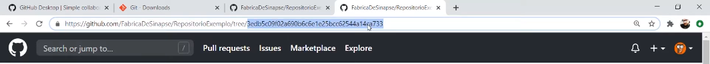

Este código é chamado de HASH. HASH nada mais é do que uma chave gerada automaticamente cada vez que você realiza um commit. É possível também realizar o download do repositório completo neste momento que selecionamos. 

> Basta clicar em `Code` e selecionar a opção `Download ZIP`.

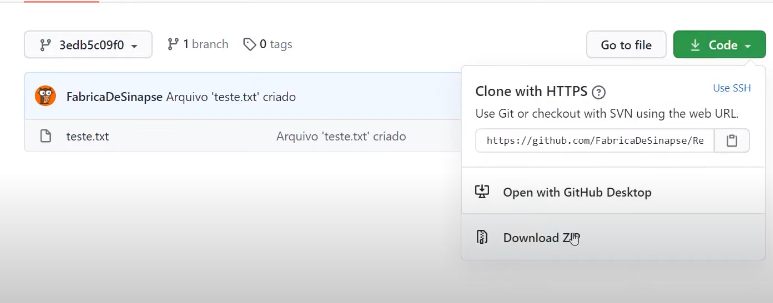

Pronto, agora nos temos o repositório completo do momento exato que escolhemos voltar. 

Caso você queira voltar para o tempo real, basta clicar no nome do repositório que tudo volta ao normal.

## Fetch/Pull: Atualizando o repositório

Após entender os comando `Commit`, `Push`e `Clone`. Vamos entender um novo comando que é o Pull. E para isto será necessário criar um novo arquivo na nuvem. 

> Com o diretório aberto selecione  `Add file` e selecione a opção `creating new file`. Preencha os campos assim como fizemos no inicio. E faça um commit. Verifique se o novo arquivo de teste foi criado.

> Voltando ao GitHub Desktop, perceba que nosso arquivo criado não foi adicionado no software. Para que este arquivo seja clonado para nossa máquina(Desktop/Laptop), na parte superior da tela selecione a opção `Fetch origin`.

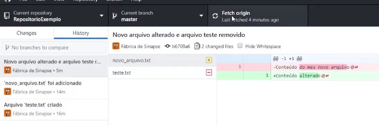

Isto fará com que as alterações feitas na nuvem sejam mostradas para o software. E logo após isso uma opção automática irá aparecer mostrando que existe um ou mais commits pendentes. Depende de quantas alterações você fez. 

Selecione a opção `Pull origin`, para que as alterações sejam salvas e adicionadas a nossa máquina(Desktop/Laptop).

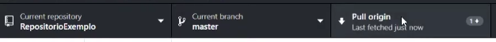

Para verificar se tudo correu como o esperado, basta verificar o repositório em nossa máquina para ver se o arquivo recém criado está lá.

> Na parte superior, selecione a opção `Repository`, logo em seguida selecione a opção `Show in Explorer`.

## Conclusão

Bom, neste tutorial nós conseguimos entender as funções do GitHub, mostrando suas funcionalidades e as facilidades no manuseio de informações que a ferramenta nos traz. 