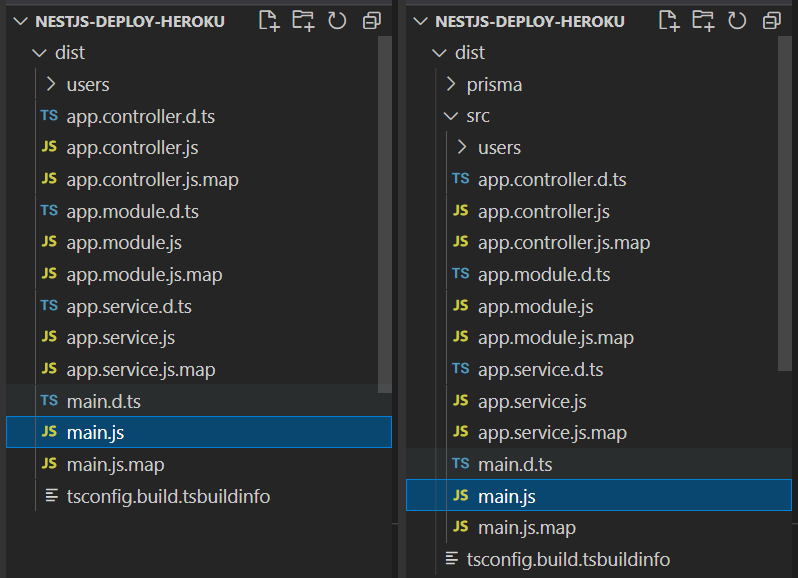

# Fazendo deploy no Heroku



Fazer o Deploy no Heroku de uma aplicação NestJS é relativamente simples, mas com alguns pequenos detalhes que são bem importantes.

Dessa vez, faremos o deploy de uma aplicação NestJS conectada a um banco de dados SQLite através do ORM Prisma.

Alterar o tipo de banco de dados e a URL para qualquer outro provedor será bem fácil através das variáveis de ambiente, então chega junto pra mais um conteúdo massa 😃

## Configuração

### Configurando a porta

Abra o arquivo `main.ts` e certifique-se de que a porta está devidamente configurada para acessar a variável de ambiente `PORT` que o Heroku fornece:

`src/main.ts`

```typescript
import { NestFactory } from '@nestjs/core';
import { AppModule } from './app.module';

async function bootstrap() {
  const app = await NestFactory.create(AppModule);

  await app.listen(process.env.PORT || 3000);
}

bootstrap();
```

### Arquivo `Procfile`

Normalmente o Heroku utiliza o comando `npm start` para rodar a aplicação. Por padrão, o Nest executa o comando `nest start` quando executamos esse script, no entanto, para rodar a aplicação em produção, é recomendado executar os arquivos JavaScript da pasta `dist` diretamente.

Para isso, precisamos criar um arquivo na raiz do projeto chamado `Procfile`, com `P` maiúsculo e sem nenhuma extensão de arquivo.

`Procfile`

```
web: npm run start:prod
```

Dessa forma, o Heroku sempre executará nossa aplicação através do comando `npm run start:prod`.

### Script `start:prod`

Por padrão, o Nest já vem com esse comando, que por baixa executa `node dist/main`.

`package.json`

```json
{
    "name": "nestjs-deploy-heroku",
    // ...
    "scripts": {
        // ...
        "start:prod": "node dist/main"
    }
}
```

#### Atenção para alguns casos: `dist/main.ts` vs `dist/src/main.ts`

Em alguns casos, quando possuímos arquivos JavaScript ou TypeScript fora da pasta `src`, a estrutura da pasta `dist` mudará.

Certifique-se de que o arquivo `main.js`, que foi compilado a partir do arquivo `main.ts` está no caminho correto, indicado no script `start:prod`.

- Opção 1 (mais comum): `dist/main.js`;
- Opção 2 (quando tem arquivos JS ou TS fora da `src`): `dist/src/main.js`;
- Opção 3 (mais incomum): outra localização, dependendo de onde estiver seu arquivo `main.ts`.

> Se o seu arquivo `main.js` estiver em uma localização diferente da que o Nest usa como padrão, certifique-se de atualizar no script `start:prod`.

##### Alguns exemplos de estrutura da pasta `dist`



### Garantindo que a pasta `dist` está sempre atualizada

É importante garantir que o Heroku fará o build da aplicação (para manter a pasta `dist` sempre atualizada), portanto, devemos adicionar o script `heroku-postbuild` no arquivo `package.json`, informando para o Heroku sempre executar alguns comandos assim que passar da sua etapa de `build`.

`package.json`

```json
{
    "name": "nestjs-deploy-heroku",
    // ...
    "scripts": {
        // ...
        "heroku-postbuild": "npm install --only=dev --no-shrinkwrap && npm run build"
    }
}
```

## Realizando o deploy

Agora que finalizamos a etapa de configuração, basta subir o projeto para o Heroku (através do GitHub ou da própria Heroku CLI) e tudo estará funcionando normalmente.

> **ATENÇÃO!**
>
> Caso a sua aplicação não funcione, pode ser que tenha algum erro adicional, seja no build ou na execução. ☹
>
> 1️⃣ Se o erro for em build, aparecerá a mensagem `Build failed` e você poderá visualizar os erros direto pelo site do Heroku.
>
> 2️⃣ Se o erro for na execução e aparecer a mensagem `Application error` ao tentar acessar a URL gerada para o seu app, certifique-se de configurar a Heroku CLI e executar o comando `heroku logs`, para conseguir verificar qual foi o problema e tentar corrigir.
>
> 🛠 **Saiba como configurar a Heroku CLI no vídeo:** https://www.youtube.com/watch?v=n4wFqLm98x0

## Conclusão

Curtiu? Ficou fácil fazer o deploy de uma aplicação NestJS no Heroku, não?!

Agora não tem mais desculpa pra ter a sua aplicação rodando na nuvem, em um serviço completamente gratuito!

Um beijo pra vcs. 🧡
